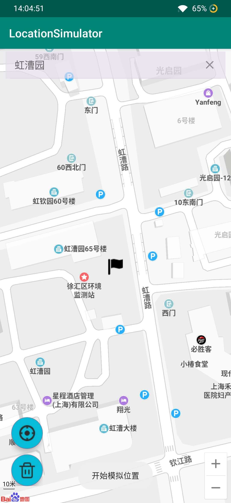

### ~~LocationSimulator~~

安卓GPS位置模拟器, 可欺骗钉钉打卡
大学的时候写过一些android app，现在公司改成钉钉打卡了，晚上加班会给钱，这不得搞一个赚点加班费，于是手写了一个

基于安卓9.0， 一加7， 需要打开开发者模式,需要将本应用设置为模拟位置应用

效果图如下：

### 更新
好久不长，最新版本5.0以上的钉钉已经不能使用这个软件了，虽然能mock定位，但是会被作弊检测。最新的钉钉作弊打卡的方式是通过exposed框架太极，与钉钉助手配合完成。

* 不需要root
* 需要先安装太极框架，然后安装钉钉助手

[太极](./asserts/com.sky.xposed.rimet_v27_c6ae69.apk)

[钉钉助手](./asserts/me.weishu.exp.MainApplication.apk)

